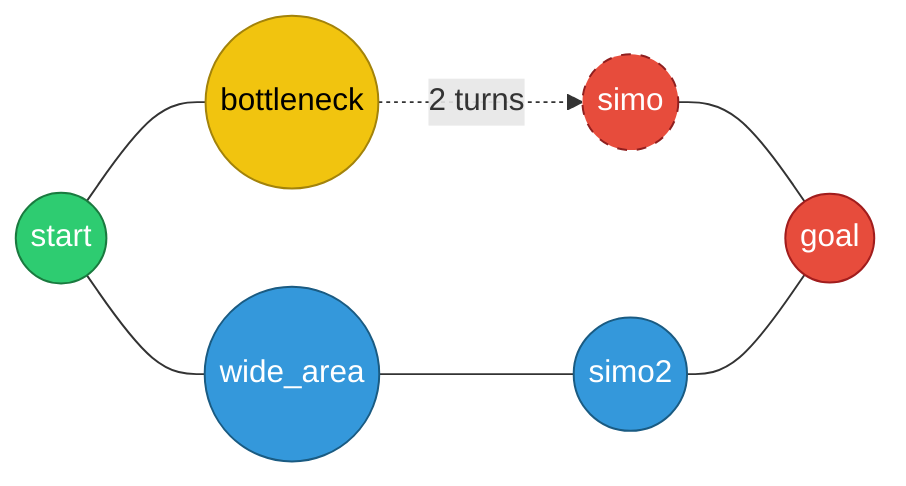
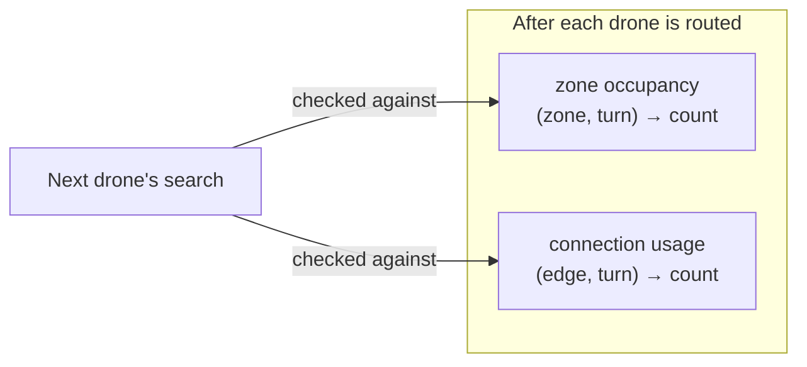
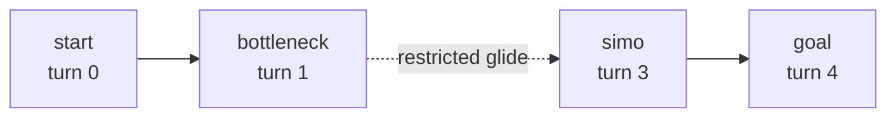

*This project has been created as part of the 42 curriculum by <mjabri>.*

<div align="center">

# 🛰️ drone-scheduler

**A time-expanded, capacity-aware multi-drone pathfinding engine — built from scratch in pure Python.**


</div>

---

## Overview

`drone-scheduler` routes a fleet of drones from a shared **start** zone to a shared **end** zone across a network of connected zones, without ever letting two drones violate a zone's or a connection's declared capacity.

It isn't just "find *a* path" — every drone is scheduled *in time* as well as in space. Two drones can't occupy the same 1-capacity zone on the same turn, restricted zones cost extra turns to cross, and a connection can only carry as many drones at once as its declared bandwidth allows. The engine treats every "*(zone, turn)*" pair as its own state and searches that expanded graph instead of the plain one.

No `networkx`, no `graphlib`, no path-finding library of any kind — the graph, the parser, and the scheduler are all hand-rolled and fully object-oriented.


---

## Features

- 📜 Custom `.txt` map DSL, parsed with a hand-written, fully validated parser
- 🕒 Time-expanded search — states are `(zone, turn)`, not just `zone`
- 🚦 Zone occupancy limits (`max_drones`) and connection bandwidth limits (`max_link_capacity`)
- 🟡 `priority` zones that are genuinely preferred during pathfinding, not just labeled
- 🔴 `restricted` zones that cost 2 turns and reserve their connection for the full glide
- ⛔ `blocked` zones that are structurally excluded from the traversable graph
- 🧠 Prioritized multi-agent planning (drones are scheduled one at a time, each respecting every reservation left by the ones before it)
- 🖍️ Colored terminal visualization of the full simulation, turn by turn
- ✅ 100% type-hinted, `flake8` + `mypy --strict`-clean, fully object-oriented

---

## Project Structure

```
.
├── main.py            # entry point — wires parsing → graph → pathfinder → output
├── parsing.py          # Parsing — reads and validates the map DSL
├── graph.py            # Zone, Connection, Graph — the in-memory network
├── algoo.py            # PathFinder — time-expanded Dijkstra + reservation system
├── output.py           # Output — colored terminal renderer
├── maps/
│   ├── easy/
│   ├── medium/
│   └── hard/
├── Makefile
├── .gitignore
└── README.md
```

---

## Installation & Usage

**Requirements:** Python 3.10+, `flake8`, `mypy`

```bash
make install     # install dependencies
make run          # run the simulation
make debug        # run the simulation under pdb
make lint         # run the flake8 and mypy  
make clean        # remove __pycache__ / .mypy_cache
```

> Point it at a different map by editing the map path passed into `Parsing(...)` in `main.py` (or via your CLI argument, if you wired one in).

---

## Map Format

Maps are plain text, parsed line by line:

```txt
nb_drones: 4

start_hub: start 0 0 [color=green]
hub: bottleneck 1 0 [color=orange max_drones=3 zone=priority]
hub: wide_area 2 0 [color=blue max_drones=3]
hub: simo 3 0 [max_drones=2 zone=restricted]
hub: simo2 4 0 [max_drones=2]
end_hub: goal 5 0 [color=red]

connection: start-bottleneck [max_link_capacity=4]
connection: start-wide_area [max_link_capacity=4]
connection: bottleneck-simo [max_link_capacity=4]
connection: wide_area-simo2 [max_link_capacity=4]
connection: simo-goal [max_link_capacity=4]
connection: simo2-goal [max_link_capacity=4]
```



### Zone Types

| Type | Cost | Behavior |
|---|---|---|
| `normal` | 1 turn | default |
| `priority` | 1 turn | preferred by the scheduler when routes tie |
| `restricted` | 2 turns | reserves its connection for both turns of the glide |
| `blocked` | — | excluded from the graph entirely |

### Attributes

| Scope | Attribute | Default | Meaning |
|---|---|---|---|
| Zone | `color` | none | visual color in terminal output |
| Zone | `max_drones` | 1 | max drones occupying the zone at once |
| Zone | `zone` | `normal` | the zone type above |
| Connection | `max_link_capacity` | 1 | max drones crossing simultaneously |

---

## Algorithm

The scheduler is a **prioritized-planning, time-expanded search** — drones are planned one at a time, and each one's search respects every reservation left behind by the drones planned before it.

**1. States are `(zone, turn)`, not just `zone`.**
Every position in the search is "*be at this zone at the start of this turn*." This is what lets the algorithm reason about *when* a zone is occupied, not just *whether* it's on the path.

**2. Turn-ordered frontier expansion.**
The open set is always processed in strictly non-decreasing turn order, so the first time the goal state is reached, it's guaranteed to be the earliest possible arrival given the current reservations — classic Dijkstra behavior, adapted to a time-expanded graph. Ties on the same turn are broken in favor of `priority` zones, so equally-short routes through a preferred zone are the ones actually chosen.

**3. Waiting is a first-class move.**
At every zone, a drone can choose to stay put for a turn instead of moving — capacity-checked everywhere except `start`, which has unlimited room, matching the spec.

**4. Restricted zones are a 2-turn atomic glide.**
Entering a `restricted` zone reserves its connection for *both* turns of the crossing, and the drone can't be redirected mid-flight — it commits to the full 2-turn transit the moment it enters.

**5. Two reservation tables enforce every capacity rule:**



Every zone and connection a drone actually uses gets reserved for the turn(s) it occupies it. The *next* drone's search checks both tables before committing to any move — this is what turns a set of independent shortest paths into a genuinely collision-free schedule.

**Example — one drone crossing a restricted zone:**



---

## Visual Representation

The simulation renders as colored, turn-by-turn terminal output — each drone's movements are printed under the turn they happen on, colored by the destination zone's declared `color`, so congestion and zone transitions are readable at a glance without needing an external viewer:

```
Turnes: 4

Turn 1
D1-wide_area D2-wide_area D3-bottleneck D4-bottleneck

Turn 2
D1-simo2 D2-simo2 D3-bottleneck-simo D4-bottleneck-simo

Turn 3
D1-goal D2-goal D3-simo D4-simo

Turn 4
D3-goal D4-goal
```

Drones that reach `goal` stop appearing in subsequent turns — they're delivered and no longer tracked, which keeps the output readable as more drones finish.

> **No built-in graphical visualizer** — between the parser, the scheduler, and getting every edge case right, there wasn't time left to also build a graphical viewer for this project. If you want to see a simulation played out visually instead of reading raw terminal output, my friend **smakkas** built one: **[fly-in-visualizer](https://fly-in-visualizer-smakkass.vercel.app/)** — just drop your map output in and it plays it back.

---

## Performance

| Map | Drones | Turns achieved | Target |
|---|---|---|---|
| Linear path | 2 | ≤ 6 |
| Simple fork | 3 | ≤ 6 |
| Basic capacity | 4 | ≤ 8 |
| Dead end trap | 5 | ≤ 15 |
| Circular loop | 6 | ≤ 20 |
| Priority puzzle | 4 | ≤ 12 |
| Maze nightmare | 8 | ≤ 45 |
| Capacity hell | 12 | ≤ 60 |
| Ultimate challenge | 15 | ≤ 45 |

---

## Resources

**References used while building this:**
- [Dijkstra's algorithm](https://en.wikipedia.org/wiki/Dijkstra%27s_algorithm)
- [Multi-Agent Path Finding (MAPF) — prioritized planning](https://en.wikipedia.org/wiki/Multi-agent_pathfinding)
- [PEP 257 — Docstring Conventions](https://peps.python.org/pep-0257/)
- [mypy documentation](https://mypy.readthedocs.io/)


---

## Built With

Python 3.10+ · zero external graph libraries · 42 School

---

<div align="center">

**simossd**

</div>